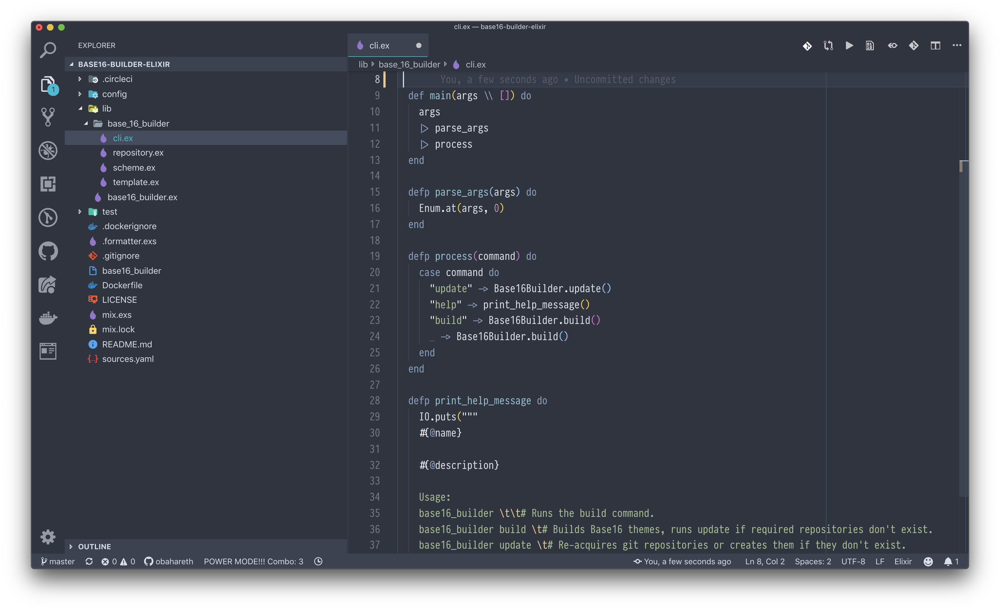

# Theme

Color Theme:&#x20;

* [Polar](https://marketplace.visualstudio.com/items?itemName=merithayan.polar) (day, via Workbench: Preferred Light Color Theme).
* [Nord](https://marketplace.visualstudio.com/items?itemName=arcticicestudio.nord-visual-studio-code) (night, via Workbench: Preferred Dark Color Theme).
* I use Window: Auto Detect Color Scheme to auto switch themes based on time of day.

Icon Theme: [Material Icon Theme](https://marketplace.visualstudio.com/items?itemName=PKief.material-icon-theme).

Font: [Pragmata Pro](https://www.fsd.it/shop/fonts/pragmatapro/).

